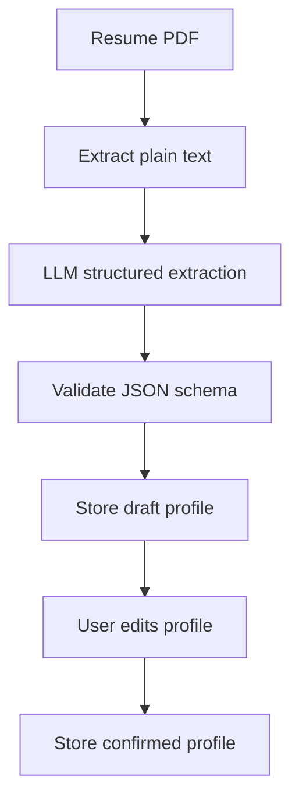

# AI Fresher Job Matcher - AI Workflow

## 1. AI Responsibilities

Use AI only where language understanding adds value.

LLM responsibilities:

- Resume parsing
- Skill extraction
- Project extraction
- Education extraction
- Certification extraction
- Optional job explanation generation

Embedding responsibilities:

- Semantic similarity between user profile and job descriptions
- Similar job detection
- Duplicate detection support

Rule-based responsibilities:

- Fresher detection
- Location checks
- Remote/on-site filtering
- Seniority filtering
- Duplicate checks
- Notification thresholds

## 2. Resume Parsing Flow



## 3. Resume Extraction JSON Shape

```json
{
  "full_name": "",
  "email": "",
  "phone": "",
  "location": {
    "city": "",
    "state": "",
    "country": ""
  },
  "education": [
    {
      "degree": "",
      "institution": "",
      "year": "",
      "score": ""
    }
  ],
  "skills": [
    {
      "name": "",
      "type": "",
      "confidence": 0.0
    }
  ],
  "projects": [
    {
      "title": "",
      "description": "",
      "tech_stack": [],
      "url": ""
    }
  ],
  "certifications": [],
  "suggested_roles": [],
  "preferred_domains": []
}
```

## 4. Guardrails

- Do not invent skills not present in the resume.
- Mark inferred fields as inferred.
- Let the user edit all extracted fields.
- Keep original extracted resume text for audit/debugging.
- If parsing confidence is low, ask user to review manually.

## 5. Job Skill Extraction

For each job, extract:

- Required skills
- Nice-to-have skills
- Role category
- Experience level
- Work mode
- Location
- Fresher suitability indicators

This can be done with a cheaper LLM pass, rules, or a hybrid approach.

## 6. Embedding Flow

Create embeddings for:

- User profile summary
- User skills and projects
- Job title and description

Use embeddings to calculate semantic score.

Do not rely only on embeddings. Seniority and location should stay rule-based.

## 7. AI Failure Fallbacks

If resume parsing fails:

- Save uploaded resume.
- Let user manually enter profile.

If job skill extraction fails:

- Use title and description keyword extraction.
- Still show the job with lower confidence.

If embedding generation fails:

- Fall back to rule-based matching.

## 8. Optional Future AI Features

- Resume improvement suggestions
- Interview question generation
- Skill-gap explanation
- Portfolio feedback
- Personalized learning plan

These should be optional, not the MVP core.

