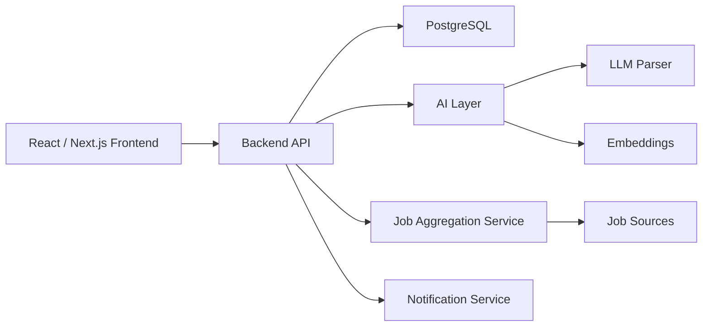
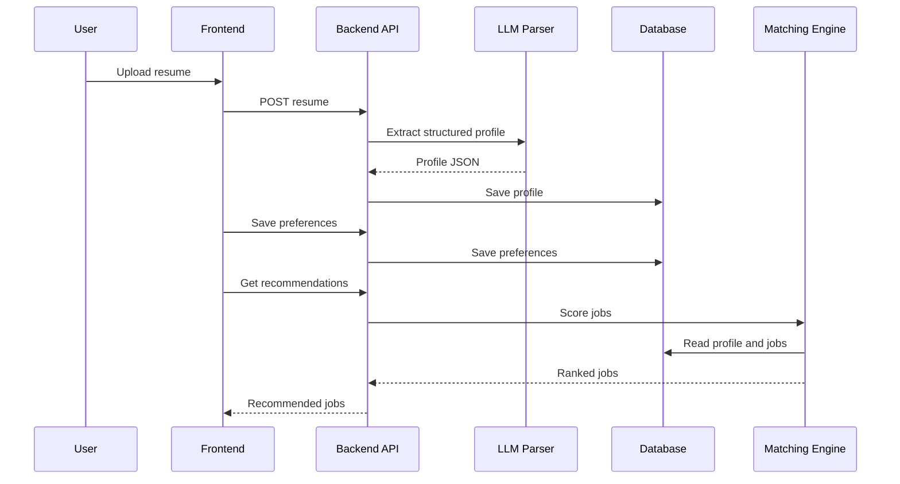

# AI Fresher Job Matcher - System Architecture

## 1. High-Level Architecture

## 2. Recommended MVP Stack

Frontend:

- Next.js
- Tailwind CSS or another UI system

Backend:

- FastAPI or Node.js
- FastAPI is recommended if the AI and scraping logic are Python-heavy.

Database:

- PostgreSQL
- pgvector if using embeddings inside PostgreSQL

AI Layer:

- LLM for resume parsing
- Embeddings for semantic matching
- Rule-based checks for hard filters

Job Aggregation:

- Playwright only where needed
- Requests/API clients where structured endpoints exist
- BeautifulSoup for simple public pages

Authentication:

- Clerk, Firebase Auth, or Auth.js

Deployment:

- Frontend: Vercel
- Backend: Render, Railway, Fly.io, or VPS
- Database: Supabase, Neon, or Railway PostgreSQL

## 3. Core Services

### Frontend App

Responsibilities:

- Authentication screens
- Resume upload UI
- Profile editor
- Preference setup
- Job dashboard
- Saved/applied job lists

### Backend API

Responsibilities:

- Auth integration
- Resume upload handling
- Profile CRUD
- Preferences CRUD
- Job listing APIs
- Recommendation APIs
- User feedback APIs

### Resume Parser

Responsibilities:

- Extract text from PDF.
- Send resume text to LLM.
- Validate LLM output against schema.
- Store structured profile.

### Job Aggregation Service

Responsibilities:

- Fetch job postings from configured sources.
- Normalize fields into a common schema.
- Detect duplicates.
- Mark stale jobs inactive.

### Matching Engine

Responsibilities:

- Apply hard filters.
- Compute skill match.
- Compute semantic match.
- Compute fresher suitability.
- Produce final match score.

### Notification Service

Responsibilities:

- Send alerts for new high-match jobs.
- Send deadline reminders.
- Prevent duplicate notifications.

## 4. Data Flow

## 5. Design Principle

Keep the system deterministic where possible.

Use:

- Rules for filtering and safety.
- Embeddings for similarity.
- LLM only for language understanding tasks like resume parsing and optional explanation.

Avoid:

- Autonomous agents in the MVP.
- Resume rewriting as a required flow.
- Auto-submitting applications.

