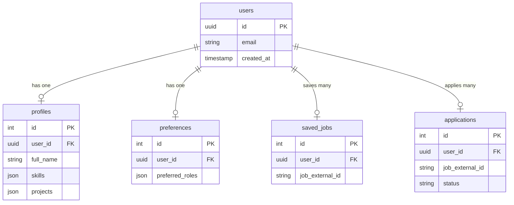
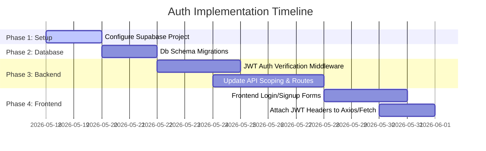

# Job-Ops Authentication & Multi-Tenant Scoping Plan

This document outlines the architecture, database changes, and progressive milestones required to transition the Job-Ops platform from a single-user local prototype to a secure, multi-tenant production system supporting user authentication.

---

## 1. Provider Comparison: Supabase Auth vs Clerk vs Firebase Auth

To implement authentication, we evaluated three industry-standard identity platforms against the specific needs of Job-Ops (FastAPI backend + Next.js app router frontend, running on a PostgreSQL database).

| Feature / Criteria | **Supabase Auth** (Recommended) | **Clerk** | **Firebase Auth** |
| :--- | :--- | :--- | :--- |
| **Primary Advantage** | Deep PostgreSQL integration & native Row-Level Security (RLS). | Turn-key premium UI components and unmatched developer experience. | Mature, robust ecosystem with generous free tiers. |
| **FastAPI Integration** | **Excellent**. Extremely clean JWT validation via standard PyJWT library using public JWKs. | **Moderate**. Mostly designed for Node environments; requires manual JWKS verification in Python. | **Good**. Stable Python Admin SDK, though can be verbose to configure. |
| **Next.js Integration** | **Excellent**. Native `@supabase/ssr` library simplifies cookie-based session state. | **Best**. Pre-built components like `<SignIn />` and state hooks. | **Moderate**. Next.js App Router integrations require manual session cookie wiring. |
| **Pricing & Limits** | **Extremely Generous**: 50,000 Monthly Active Users (MAUs) free. | **Expensive**: 10,000 MAUs free, then high scaling costs. | **Generous**: 50,000 MAUs free. |
| **Database Sync** | Natively resides in the PostgreSQL instance (`auth.users`), removing sync lag. | Requires webhook handlers or syncing via middleware into local Postgres. | Requires manual syncing of user records via API/webhooks. |

### Recommendation for Job-Ops: **Supabase Auth**
We recommend **Supabase Auth** for this project. 
*   **Rationale**: Since Job-Ops relies on a PostgreSQL relational schema, using Supabase Auth lets us cleanly map to a single database ecosystem. The JWTs generated by Supabase contain standard claim sub-keys that can be verified asynchronously by FastAPI in sub-millisecond times without database round-trips.

---

## 2. Required Database Changes

Currently, all tables in [db_models.py](file:///d:/academic/Job-Ops/backend/app/db_models.py) are global. To support multiple authenticated users, we must update the schema:



### Table Schema Schema Upgrades (SQLModel)
1.  **Profiles**:
    *   Add `sa_column=Column(ForeignKey("users.id", ondelete="CASCADE"))` or store the Auth provider's unique string identifier (`user_id: str = Field(index=True)`).
2.  **Preferences**:
    *   Add `user_id: str = Field(unique=True, index=True)`.
3.  **Saved Jobs**:
    *   Add `user_id: str = Field(index=True)`.
    *   > [!IMPORTANT]
        > **Constraint Modification**: Remove the `unique=True` flag on `job_external_id`. Multiple different users must be allowed to save the same job! Change it to a composite unique index on `(user_id, job_external_id)`.
4.  **Applications**:
    *   Add `user_id: str = Field(index=True)`.
    *   > [!IMPORTANT]
        > **Constraint Modification**: Remove the `unique=True` flag on `job_external_id`. Multiple users can apply to the same job. Replace with a composite unique index on `(user_id, job_external_id)`.

---

## 3. Scoping Profiles, Saved Jobs, and Applications

To secure operations, database queries must be filtered at the endpoint layer.

### 3.1 Backend Authentication Middleware (FastAPI)
We will introduce a JWT verification dependency that extracts the User ID from the HTTP `Authorization: Bearer <token>` header:

```python
import jwt
from fastapi import Depends, HTTPException, Security
from fastapi.security import HTTPBearer, HTTPAuthorizationCredentials

security = HTTPBearer()

def get_current_user(credentials: HTTPAuthorizationCredentials = Security(security)) -> str:
    token = credentials.credentials
    try:
        # Decodes token using Supabase public JWT key
        payload = jwt.decode(token, SUPABASE_JWT_SECRET, algorithms=["HS256"], audience="authenticated")
        user_id = payload.get("sub")
        if not user_id:
            raise HTTPException(status_code=401, detail="Invalid token claims.")
        return user_id
    except jwt.PyJWTError:
        raise HTTPException(status_code=401, detail="Invalid or expired token.")
```

### 3.2 Updating Endpoints to be User-Scoped
Endpoints will inject `get_current_user` to query records owned by the caller:

*   **Fetching Latest Profile**:
    ```python
    @router.get("/profile/latest")
    async def fetch_latest_profile(
        current_user_id: str = Depends(get_current_user),
        session: Session = Depends(get_session)
    ):
        statement = select(Profile).where(Profile.user_id == current_user_id).order_by(desc(Profile.created_at)).limit(1)
        # ... return profile ...
    ```

*   **Saving a Job**:
    ```python
    @router.post("/saved")
    async def save_job(
        job_data: SavedJobCreate,
        current_user_id: str = Depends(get_current_user),
        session: Session = Depends(get_session)
    ):
        db_save = SavedJob(**job_data.model_dump(), user_id=current_user_id)
        session.add(db_save)
        session.commit()
    ```

---

## 4. Migration Risks & Mitigation

1.  **Orphaned "Anonymous" Data**:
    *   *Risk*: Users who created profiles or saved jobs *before* signing up will lose their state.
    *   *Mitigation*: Implement a "Local Storage Sync" step on the frontend: when a user registers, check if they have a local profile or saved jobs cache, POST it to the server with their new auth header, and then clear local storage.
2.  **Constraint Failures during Table Migration**:
    *   *Risk*: Changing `job_external_id` from a global unique constraint to a composite index can fail if duplicate rows already exist in the database.
    *   *Mitigation*: Run a clean migration script that drops existing unique constraints, deletes conflicting test records, and applies the new composite index.
3.  **Third-Party API Dependency/Latency**:
    *   *Risk*: Verifying JWTs against a remote JWKs endpoint adds latency to every API call.
    *   *Mitigation*: Cache the JWKs public certificates in memory with a 24-hour expiration so token verification remains a local, sub-millisecond CPU-bound check.

---

## 5. Phased Implementation Steps



### Milestone 1: Environment & Platform Setup (1-2 Days)
*   Provision a new Supabase Project.
*   Secure JWT credentials and retrieve the public JSON Web Key Sets (JWKs).
*   Add Next.js auth environment variables to `.env.local` and FastAPI configurations.

### Milestone 2: Schema Migrations (2 Days)
*   Write an Alembic migration script to:
    *   Add a nullable `user_id` to `profiles`, `preferences`, `saved_jobs`, and `applications`.
    *   Drop global unique constraints on `job_external_id` for both saved jobs and applications.
    *   Apply unique composite indexes on `(user_id, job_external_id)`.

### Milestone 3: FastAPI Security Layer (3 Days)
*   Implement `get_current_user` dependency validating Supabase JWTs.
*   Update onboarding, recommendations, jobs, and applications endpoints to filter all DB reads/writes by the validated user ID.
*   Update mock test suites to mock `get_current_user` to return a dummy user ID, ensuring tests continue to run cleanly.

### Milestone 4: Next.js UI Integration & Token Transmission (3 Days)
*   Install `@supabase/supabase-js` and `@supabase/ssr`.
*   Create customizable login/signup forms inside a modern styled modal or `/login` page using our rich visual CSS theme.
*   Configure Next.js middleware to automatically redirect unauthenticated users to `/login`.
*   Update frontend fetch wrappers to attach `Authorization: Bearer <token>` in request headers when a session exists.
