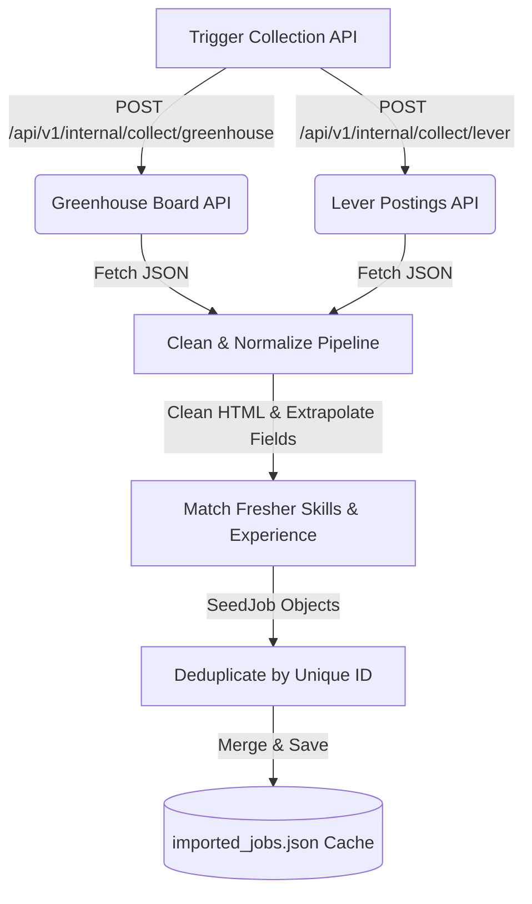

# AI Fresher Job Matcher - Job Aggregation Strategy

## 1. Goal

Collect fresher-friendly jobs from mainstream and hidden sources, normalize them into one schema, remove duplicates, and keep listings fresh.

## 2. Source Priority

Start with sources that are practical and less dependent on aggressive scraping.

Priority order:

1. ATS portals with public job pages or APIs.
2. Company career pages.
3. Remote/startup job boards.
4. Mainstream portals after the MVP works.

## 3. Phase 1 Sources

- Greenhouse
- Ashby
- Lever
- Workable
- YC Work at a Startup
- RemoteOK
- Remotive
- Wellfound, if feasible
- Manually seeded company career pages

## 4. Phase 2 Sources

- Internshala
- Naukri
- LinkedIn
- Indeed
- Unstop
- Freshersworld
- Cutshort
- Hirist

These are useful for Indian freshers but may involve anti-bot protection, unstable HTML, or stricter terms.

## 5. Normalized Job Fields

Every source should become this shape:

```json
{
  "title": "",
  "company_name": "",
  "description": "",
  "location": "",
  "is_remote": false,
  "job_type": "",
  "experience_min": null,
  "experience_max": null,
  "apply_url": "",
  "source_url": "",
  "posted_at": null,
  "discovered_at": "",
  "source_name": ""
}
```

## 6. Fetch Methods

### API

Use where available. Best option.

Examples:

- Some Greenhouse boards expose structured job data.
- Some job boards provide public feeds or APIs.

### HTML Fetch

Use for simple public pages that do not require JavaScript rendering.

### Playwright

Use only when needed for JavaScript-rendered pages.

### Manual Seed

For MVP, manually seed important company career pages and run simple checks against them.

## 7. Freshness Policy

- Run collectors daily for MVP.
- Mark jobs stale if not seen for 14-30 days.
- Prefer discovered date when posted date is unavailable.
- Do not notify users about stale jobs.

## 8. Deduplication Rules

Strong duplicate:

- Same apply URL.
- Same source external ID.
- Same company, normalized title, and normalized location.

Possible duplicate:

- Similar title.
- Same company.
- Similar description.
- Same city or remote status.

Use content hash plus fuzzy matching.

## 9. Data Quality Checks

Reject or downrank jobs if:

- Title is empty.
- Company is empty.
- Apply URL is missing.
- Description is too short.
- Job looks senior-only.
- Source is known for low-quality listings.

## 10. Legal and Reliability Notes

- Prefer public APIs and public career pages.
- Respect robots and terms where applicable.
- Avoid login-required scraping in MVP.
- Avoid auto-apply flows.
- Cache results to reduce repeated requests.


## 11. Implementation Architecture (Greenhouse & Lever Collectors)

We have successfully implemented the first production-grade job collectors utilizing public, authenticated-free ATS APIs, completely eliminating the need for aggressive login scraping or browser simulation.

### 11.1 Architecture & Pipeline



### 11.2 Normalization Pipeline & Parsing Mechanics
- **HTML Cleaning (`clean_html`)**: Automatically strips script/style tags, removes block structural syntax (e.g. `<div/>`, `<p/>`), unescapes HTML entities, and formats descriptions into normalized, readable plain text.
- **Skill Extraction (`extract_skills`)**: Performs full-text case-insensitive regex boundary matching against 50+ key fresher-friendly technologies (e.g., `Python`, `TypeScript`, `C++`, `Go`) to avoid false positives (e.g. matching `Go` within `good`).
- **Experience Bound Parsing (`parse_experience`)**: Extrapolates experience limits dynamically using a hierarchy of regex rules (e.g., `'1 to 3 years'`, `'2+ years'`, `'minimum of 2 years'`).

### 11.3 Data Storage & Retrieval
- **Persistence Layer**: Collected jobs are persisted in `data/imported_jobs.json` to keep database schemes lightweight.
- **Deduplication Invariant**: Jobs are merged on write using unique external IDs:
  - **Greenhouse**: `greenhouse-{board_token}-{id}`
  - **Lever**: `lever-{company_id}-{id}`
- **Unified Retrieval**: The system dynamically loads both seed jobs and imported jobs in-memory with automatic cross-source deduplication via `load_all_jobs()`. This unified dataset powers:
  - `GET /api/v1/jobs` (Job Listings)
  - `GET /api/v1/jobs/{external_id}` (Job Details with personalized match explainers)
  - `POST /api/v1/roadmap/skill-gap` (Roadmap recommendations)
  - Personalized recommendation streams


## 12. Robust Deduplication Engine

To ensure a clean job recommendation dashboard free of duplicates when combining seeded jobs and dynamic ATS crawls, a multi-tiered deduplication processor is active inside `app/seed_loader.py`.

### 12.1 Field Normalization Standard
Before comparison, fields are standard-normalized using dedicated routines:
1. **Title Normalization**: Lowercases, strips common location/commitment tags (such as `remote`, `hybrid`, `full-time`, `part-time`), collapses punctuation, and trims extra spaces.
2. **Company Normalization**: Lowercases, strips common business suffixes (like `inc`, `llc`, `ltd`, `corp`, `co`, `corporation`), collapses punctuation, and trims extra spaces.
3. **Location Normalization**: Lowercases and collapses variations of remote locations (`remote`, `us remote`, `usa remote`, `anywhere`, `wfh`) directly to a single `"remote"` keyword.
4. **URL Normalization**: Fully parses and normalizes job apply links, lowercasing the scheme/domain, converting the path to lowercase, stripping trailing slashes, and removing noisy tracking/query parameters (e.g. `?utm=source`).

### 12.2 Multi-Tier Deduplication Hierarchy
Jobs are processed sequentially. If a job triggers any of the following four tiers of matching against already-seen jobs, it is flagged as a duplicate and skipped:

| Tier | Name | Match Conditions | Notes |
|---|---|---|---|
| **Tier 1** | **External ID** | `job.external_id` matches an existing ID. | Strongest signal. |
| **Tier 2** | **Normalized URL** | `normalize_url(job.apply_url)` matches an existing URL. | Identifies duplicate listings posted across different systems. |
| **Tier 3** | **Normalized Key** | Normalized `(company, title, location)` tuple matches. | Fallback check for same role/location variations. |
| **Tier 4** | **Content Hash** | Normalized `company` matches and SHA-256 hash of cleaned `description` text matches. | Identifies identical description contents across different URLs/titles. |

Seeded jobs are loaded first and thus hold precedence over crawl-imported duplicate listings.


