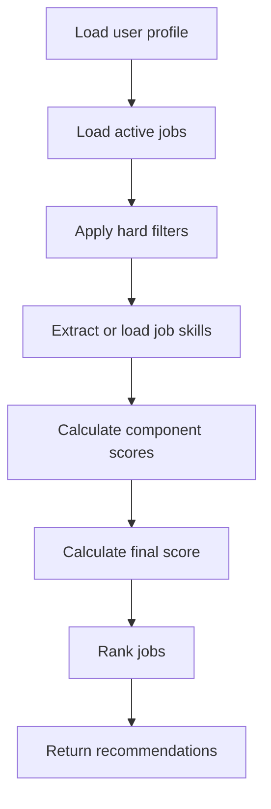

# AI Fresher Job Matcher - Matching Logic

## 1. Matching Philosophy

The matcher should prioritize jobs that are realistically useful for freshers.

It should not simply recommend every job that contains a matching keyword. A Python fresher should not see mostly senior Python architect roles.

## 2. Matching Pipeline



## 3. Hard Filters

Hard filters remove jobs before scoring.

Remove job if:

- Job is inactive.
- Job is already rejected by user.
- Job is already applied by user unless viewing history.
- Experience minimum is clearly above user level.
- Location is incompatible with user preference.
- Job type is incompatible with user preference.
- Job title contains blocked seniority terms and no fresher indicators.

Example seniority blockers:

- senior
- staff
- principal
- lead
- manager
- architect
- 5+ years
- 7+ years

Exception:

- Do not block if the user explicitly selected those roles.

## 4. Fresher Suitability Detection

Positive indicators:

- fresher
- graduate
- new grad
- entry level
- junior
- trainee
- intern
- internship
- campus
- associate software engineer
- 0-1 years
- 0-2 years
- no experience required

Negative indicators:

- senior
- staff
- principal
- lead
- architect
- manager
- 3+ years
- 5+ years
- 7+ years
- enterprise architect

Fresher score:

- Strong fresher indicators: 1.0
- Junior/associate indicators: 0.8
- No experience mentioned: 0.5
- Senior indicators: 0.0 to 0.2

## 5. Component Scores

### Skill Score

Compares user skills with required job skills.

Suggested formula:

```text
skill_score = matched_required_skills / total_required_skills
```

Boost if the user has important core skills listed in title or requirements.

### Semantic Score

Use embeddings to compare:

- User profile summary + skills + projects
- Job title + description + requirements

Suggested range:

- 0.8 to 1.0: very strong semantic fit
- 0.6 to 0.8: decent fit
- 0.4 to 0.6: weak but possible
- below 0.4: poor fit

### Location Score

Suggested rules:

- Remote and user wants remote: 1.0
- Same city: 1.0
- Same state: 0.75
- Same country: 0.5
- Relocation required and user willing: 0.6
- Incompatible location: hard filtered

### Experience Score

Suggested rules:

- Internship/fresher: 1.0
- 0-1 years: 1.0
- 0-2 years: 0.9
- 1-3 years: 0.6
- 3+ years: 0.2
- 5+ years: hard filter for fresher users

### Freshness Score

Suggested rules:

- Discovered within 3 days: 1.0
- 4-7 days: 0.8
- 8-14 days: 0.6
- 15-30 days: 0.3
- older than 30 days: 0.1 or inactive

## 6. Final Score Formula

MVP formula:

```text
final_score =
  skill_score * 0.30 +
  semantic_score * 0.25 +
  fresher_score * 0.20 +
  location_score * 0.15 +
  freshness_score * 0.10
```

This weighting keeps fresher suitability important. A strong skill match should not overpower a clearly senior job.

## 7. Score Labels

- 85-100: Excellent match
- 70-84: Good match
- 55-69: Possible match
- Below 55: Low match

## 8. Recommendation Explanation

Each job should include a short explanation:

```text
Matched because your Python, SQL, and FastAPI skills align with the role, and the listing is marked entry-level and remote.
```

Avoid overconfident claims. Use practical reasons based on known data.

## 9. Feedback-Based Improvements

Feedback signals:

- Saved job: positive
- Applied job: strong positive
- Rejected as irrelevant: negative
- Reported duplicate: remove or merge
- Reported not fresher-friendly: reduce fresher score for similar listings

Phase 2 can use feedback to adjust ranking weights per user.

