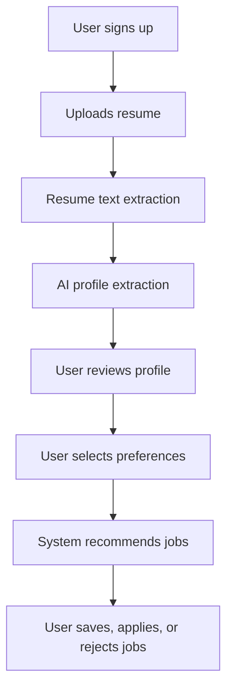
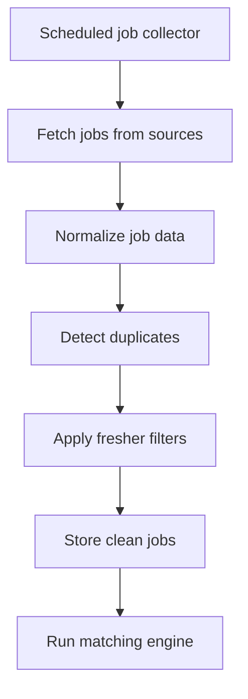

# AI Fresher Job Matcher - User Workflow

## 1. First-Time User Flow

## 2. Resume Upload Flow

1. User uploads resume as PDF.
2. Backend validates file type and file size.
3. System extracts text from PDF.
4. Extracted text is stored securely.
5. LLM converts resume text into structured JSON.
6. User is shown an editable profile.

## 3. Profile Review Flow

The user should not be forced to trust AI extraction blindly.

Editable fields:

- Name
- Email
- Phone
- Location
- Education
- Skills
- Projects
- Certifications
- Preferred roles
- Preferred domains
- Experience level

If extraction fails, the system should let the user manually create a profile.

## 4. Preference Selection Flow

User selects:

- Preferred role types
- Preferred tech stack
- Location
- Remote, hybrid, or on-site
- Internship, full-time, contract, or part-time
- Willingness to relocate
- Minimum acceptable stipend/salary, optional

## 5. Job Discovery Flow

## 6. Recommendation Flow

1. Load user profile.
2. Load user preferences.
3. Fetch active jobs.
4. Remove jobs user already rejected or applied to.
5. Apply hard filters.
6. Compute match score.
7. Return ranked recommendations.

## 7. User Feedback Flow

User actions:

- Save job
- Mark as applied
- Mark as not interested
- Report duplicate
- Report irrelevant job

Feedback should influence ranking later.

## 8. Notification Flow

MVP can start without notifications. Phase 2 can add:

- New high-match job alert
- Deadline reminder
- Saved job reminder
- Weekly recommendation summary

Notification rule:

- Notify only if match score crosses a threshold.
- Do not send repeated alerts for the same job.

